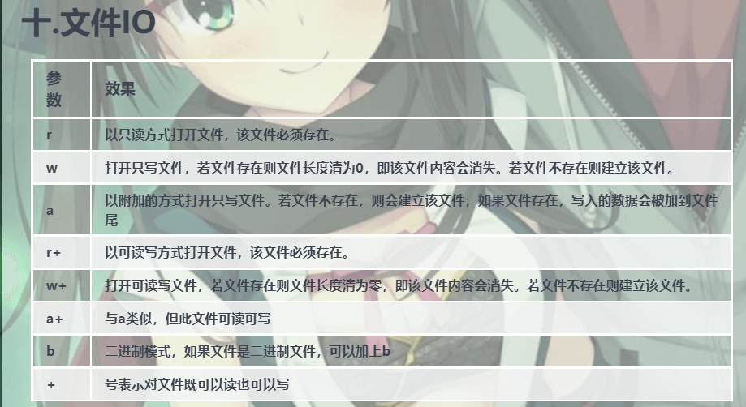
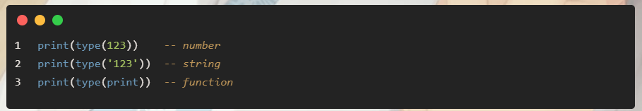
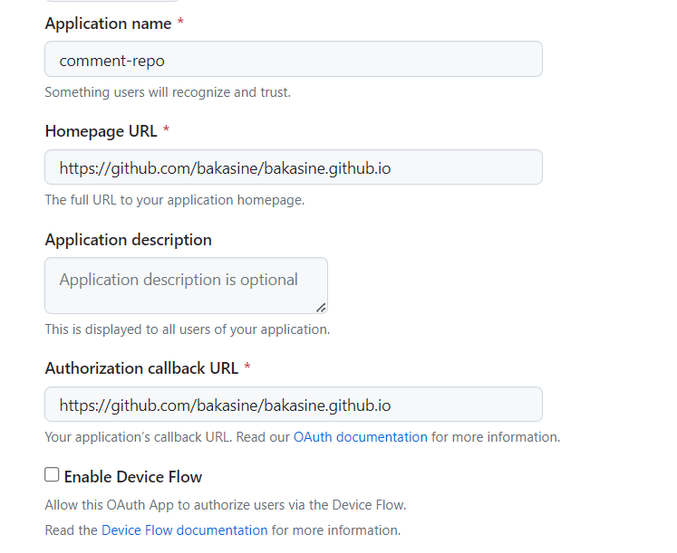

# gal-theme

在 [fnsflm/hexo-theme-gal](https://github.com/fnsflm/hexo-theme-gal) 修改了一些内容, 原项目是[忧郁的弟弟](https://www.kkgal.com/)网站主题WordPress的hexo移植版本

详细说明和使用方法见[wiki](https://github.com/fnsflm/hexo-theme-gal/wiki)

[个人站点](https://hentai121.github.io/)

**更新:**

1. 添加markdown的列表格式

2. 添加mac代码块格式(通过配置的mac_style进行开关),添加代码块复制功能

3. 还有一些小bug的修复

# 主题安装流程

gal-theme安装问题

	1.新本版node的npm版本太高，sass不能支持，最高只能使用版本7的npm。可以下载v16.10的node。
		版本太高可以尝试一下命令回退
			npm install npm@7.20.0 -g
			
	2.国内网络会导致下载各种依赖出问题通过一下命令修改源
	    下载国外的资源众所周知的慢，常用设置镜像
		yarn全局安装及设置镜像
			npm install -g yarn
			yarn config set registry http://registry.npm.taobao.org/ -g
			yarn config set sass_binary_site http://cdn.npm.taobao.org/dist/node-sass -g
			npm config set registry https://registry.npm.taobao.org
			npm config get registry // 查看是否配置成功
			npm config list  // 查看npm当前配置
			npm cache clear --force // 强制清除缓存
        然后再安装gal-theme的依赖
			yarn add hexo-renderer-sass
			yarn add hexo-renderer-scss
			cnpm install hexo-generator-json-content --save
		如果 hexo g 后 sass 还是报错可以改用 cnpm 安装
		    cnpm install node-sass
			
			
# gitalk

*评论在本地无法调试,需要部署后才能正常调试

[创建](https://github.com/settings/applications/new)

